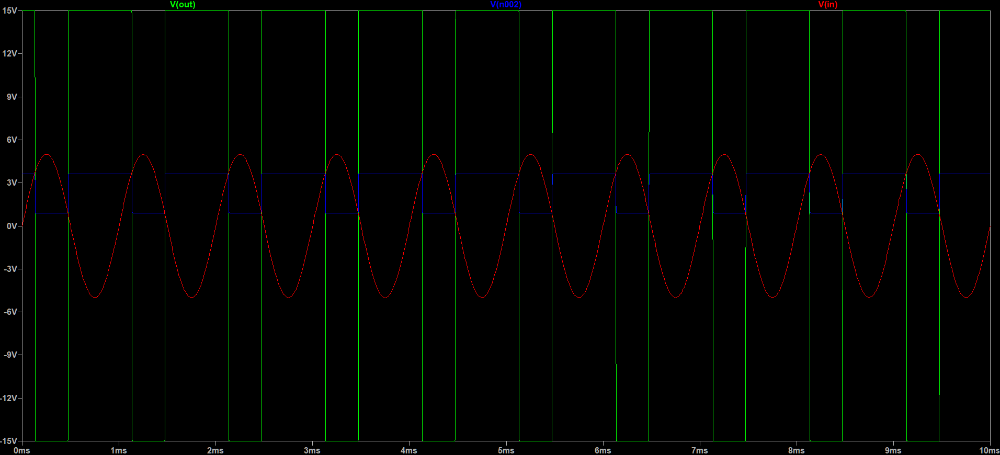
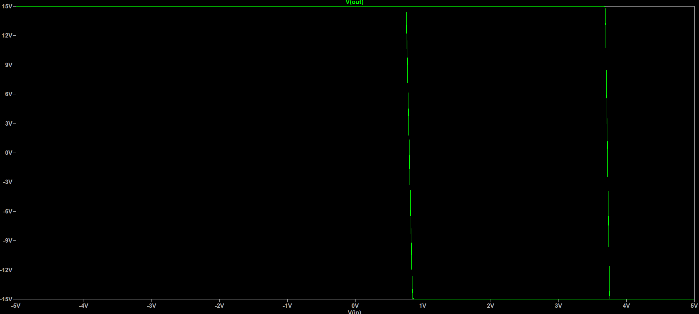

# Schmitt Trigger Simulation in LTspice

A simulation of an **Inverting Schmitt trigger with a reference voltage**, built and analysed in LTspice as part of my coursework at **Muthoot Institue of Technology & Science**.

A Schmitt trigger is a comparator with hysteresis: positive feedback makes the output switch at two different thresholds (upper and lower), so it ignores noise on slowly changing inputs. In this design, a 2.5 V reference shifts the hysteresis window away from 0 V.


## Circuit Overview

| Parameter | Value |
|-----------|-------|
| Type | Inverting Schmitt trigger with reference voltage |
| Op-amp | LTspice UniversalOpAmp2 (level 2): Avol = 1 Meg, GBW = 10 MHz, slew rate = 10 V/µs, Rail = 0 |
| Supply voltage | ±15 V |
| R1 (non-inverting node to reference) | 1 kΩ |
| R2 (output to non-inverting node, feedback) | 10 kΩ |
| Reference voltage (V_ref) | 2.5 V |
| Input signal | 1 kHz sine, 5 V peak, 0 V offset |
| Analysis | `.tran 0 10m 0 1u` |

## Theory

The input drives the inverting terminal. The voltage at the non-inverting terminal depends on the output level:

```
V+ = V_ref × R2/(R1+R2) + V_out × R1/(R1+R2)
β  = R1/(R1+R2) = 1/11 ≈ 0.0909
```

The thresholds are found by setting V_out to each saturation level:

```
V_UTP = V_ref × R2/(R1+R2) + β × V_sat(+)
V_LTP = V_ref × R2/(R1+R2) + β × V_sat(−)
Hysteresis width = V_UTP − V_LTP = β × (V_sat(+) − V_sat(−))
Centre of window = V_ref × R2/(R1+R2) = 2.27 V
```

Because the input goes to the inverting terminal, the output switches **low** when V_in rises above V_UTP and **high** when V_in falls below V_LTP.

## Results

Calculated values assume ideal saturation at ±15 V. Replace with the actual output levels read from the simulation if they differ.

| Quantity | Calculated | Simulated |
|----------|-----------|-----------|
| Upper threshold (V_UTP) | 3.64 V | [ ] V |
| Lower threshold (V_LTP) | 0.91 V | [ ] V |
| Hysteresis width | 2.73 V | [ ] V |
| Output high level | +15 V (ideal) | [ ] V |
| Output low level | −15 V (ideal) | [ ] V |

Expected timing for the 1 kHz, 5 V peak input (from the thresholds above): the output falls at about 0.13 ms and rises at about 0.47 ms in each cycle, so it is **high for roughly 66% of each period** (not 50%) because the window is centred at 2.27 V instead of 0 V.

### Transient response
Input sine wave and output, showing the switching points.



### Hysteresis curve (V_out vs V_in)


## What I Simulated

- Transient analysis (`.tran`) with a 1 kHz sine input
- Switching thresholds and hysteresis width, compared with hand calculations
- Effect of the 2.5 V reference on the position of the hysteresis window


## Author

**Melissa Sebastian**
Muthoot Institue of Technology & Science· Electronics & Communication/2024
www.linkedin.com/in/melissa-sebastian-49249020b
